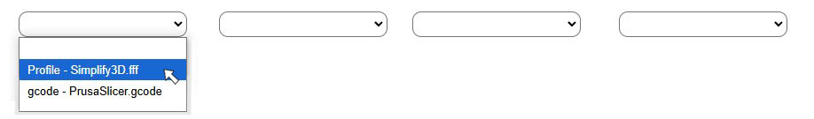

# Compare 3D Print Profiles

<details>
<summary>Documnet Navigation</summary>

- [Adding a New Slicer Program](#adding-a-new-slicer-program)
- [Adding gcode and 3D Print Profiles](#adding-gcode-and-3d-print-profiles)
- [To Use](#to-use)
- [Required Packages - Windows Only](#required-packages---windows-only)
   - [Windows Requirements](#windows-requirements)

</details>

Use this template to compare 3D print profiles from different slicers. Current slicer programs the template can use:

1. Slic3r
2. Simplify3D
3. PrusaSlicer


If the slicer used is one of the above, you can use this template as is. But - if not, before using ensure that:

1. The slicer program exports gcode with the print settings commented out in the sliced gcode file.
2. The slicer exports it's printing profiles as human readable data.


## Adding a New Slicer Program:

If one of the two conditions above is met, this template can be used as is if the assignment character in the exported gcode is a `=` character, and the slicer exports 3D print profiles as either an `ini`, `fff`, or `xml` file. Also, if `ini` files are used for exporting printer profiles, the assignment character needs to be a `=` character to use as is. For best results configure for the slicer. In most cases a line for the slicer can be added to the config file `config/slicerPrograms.json`. If needed, a **script file** may be needed if an assignment character other than the `=` character is used to assign values to the print profile properties.
<br><br>
To add a new profile input the name of the slicer (_with no space_) as the property, and the assignment character as the value in `config/slicerPrograms.json`. If needed, modify the assignment character (_use `scripts/Simplify3D.php` as a guide_) and add a custom php script file in the `scripts` folder using the property name from `config/slicerPrograms.json` as the php file name. For instance the property value of **"Simplify3D"** : **"--,--"** has a script file named **Simplify3D.php**. For the property "Simplify3D" **--,--** was used as the value for the assignment character instead of **,** (_actual assignment character_) as some properties used a comma character in the value. 
<br><br>
If adding a script file you'll have to modify it so that the assignment character can split the property name from the property value for the 3D printing progile. In the case of `Simplify3D`:

1. New lines are temporarily replaced with a marker.
2. The marker is formatted so that when the new lines are added back the properties and values can be extracted using the first `,` as the assignment operator.
3. The first assignment character `,` is replaced with `--,--` after the new lines are added back.
   - This is used so that commas in the propety value are not used to split an unwanted property value pair.
3. The first three lines, and the last line are deleted.


## Adding gcode and 3D Print Profiles:
Add `gcode`, `ini`, `fff`, and `xml` files to the parse folder. File names can contain space, or be numerical. If using numerical files, only use numbers for the file names, ensure that they are in sequential order, and do not duplicate a numeric file e.g. 1.gcode and 1.ini.
If files are not in order and sequential they will be parsed - but not in numeric order. They will be parsed in the order they were output from the terminal using the script file `scripts/file_count.php`.


## To Use:

**NOTE** - for Windows 10 or later, additional packages are needed.

This can be used in codespaces, or cloned/downloaded locally, then used with `localhost:PORT`. The below snippet (_copy/paste_) should suffice in either case:

```markdown
php -S localhost:8000
```
- **NOTE** - see wikipedia article [List of TCP and UDP port numbers](https://en.wikipedia.org/wiki/List_of_TCP_and_UDP_port_numbers#:~:text=Hypertext%20Transfer%20Protocol) for an explanation of localhost port number i.e. localhost:`8000`.
- **NOTE** - will be a bit buggy in GitHub Codespaces.


Once the app starts:

1. Select the top dropdown to select folder nested in parse i.e. `parse/gcode`. 
   - If print profiles to compare are in root of `parse` no need to select from top dropdown.
2. From the bottom 4 dropdown select the print profile to view.<br>
 <br>
3. To compare profiles select more than one and click **Show Difference**.
   - NOTE - this will only work if the files were derived from same slicer and same number of properties.
   
   
## Required Packages - Windows Only:

On recent Mac OS and Linux like machines all the packages needed to start a localhost should be installed. On Windows - some additional installs will be needed:

1. `cygwin`
2. `php`
3. `git` - _optional_
4. `chocolatey` - _optional_


### Windows Requirements

The below will be needed to get a localhost up and running on Windows.

1. Windows 10 or later.

2. **Cygwin** packages for Windows. To install either:
   - Visit the [cygwin site](https://www.cygwin.com/install.html) for installation instructions.
   - <ins>Or</ins> copy/paste below into terminal: <hr>

```markdown
winget install Cygwin.Cygwin
```

3. **PHP** installed on Windows. To install either:
   - Visit the [php site](https://www.php.net/downloads) for installation instructions.
   - <ins>Or</ins> follow the steps below: <hr>

- **ONE** - install [chocolatey](https://chocolatey.org/):      

```markdown
winget install Chocolatey.Chocolatey
```

- **TWO** - from an elevated shell (_comman line as admin_) run:     

```markdown
choco install php
```

- **THREE** - start a new terminal and ensure php was installed:

```markdown
php --version
```
- If something like `PHP 8.1.0 (cli) (built: Nov 23 2021 21:46:10) (NTS Visual C++ 2019 x64)` appears, then you should be good to go.

4. Clone the repo using `git` (_if it is installed go to step 5_), or download the zip file for this template repo. 
   - If git is **NOT** installed:
   - Visit the [git for windows site](https://gitforwindows.org/) for installation instructions.
   - <ins>Or</ins> follow the steps below: <hr>
  
```markdown
winget install Microsoft.Git
```     

- Start a new terminal and ensure git was installed:

```markdown
git --version
```

- If something like `git version 2.46.0.windows.1` appears, then you should be good to go.

5. If git is installed: 
   - **NOTE** - if installed using above instructions, start a new terminal.
   - Copy/paste below to download this template repo:

```markdown
git clone https://github.com/jhauga/compare-3dprint-profiles.git
```
6. Navigate to where this template repo was downloaded and start a local host.

```markdown
cd compare-3dprint-profiles
```

```markdown
php -S localhost:8000
```
   